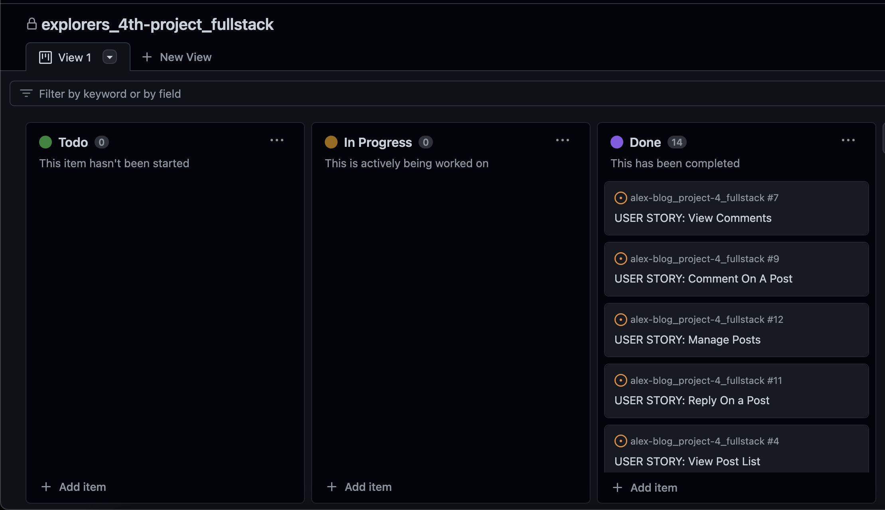
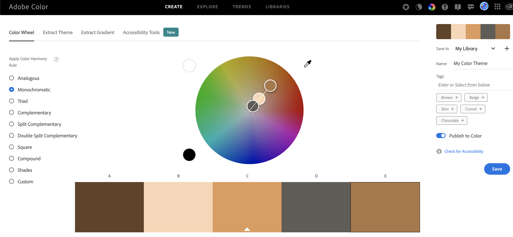

# e x p l o r e r s _

Start diving in a world of curiosity, facts, truthness...exploration. Explorers(link to be attached) is a place of knowledge, a place for the curious minds where the information is well researched before being presented to the users.

AM I RESPONSIVE GOES HERE

[View EXPLORERS live website here] (heroku project link to be attached)

## **Table of Contents**
### [User Experience](#user-experience-ux)
* [Project Goals](#project-goals)
* [Agile Methodology](#agile-methodology)
* [Target Audience](#target-audience)
* [First time user](#first-time-user)
* [Registered user](#registered-user)
* [Admin user](#admin-user)
### [Design](#design-1)
* [Color Scheme](#color-scheme)
* [Images](#images)
* [Favicon](#favicon)
* [Typography](#typography)
* [Wireframes](#wireframes)
* [Data Model](#data-models)
* [User Journey](#user-journey)
* [Database Scheme](#database-scheme)
### [Security Features](#security-features-1)
### [Features](#features-1)
* [Existing Features](#existing-features)
* [Features Left to Implement](#features-left-to-implement)
### [Technologies Used](#technologies-used-1)
* [Languages Used](#languages-used)
* [Databases Used](#databases-used)
* [Frameworks Used](#frameworks-used)
* [Programs Used](#programs-used)
### [Deployment and Local developement](#deployment-and-local-developement-1)
* [Local Developement](#local-developement)
* [ElephantSQL Database](#elephantsql-database)
* [Cloudinary](#cloudinary)
* [Heroku Deployment](#heroku-deployment)
### [Testing](#testing-1)
### [References](#references-1)
* [Docs](#docs)
* [Content](#content)
* [Acknowledgments](#acknowledgments)

## **User Experience (UX)**

The website offers a friendly and captivating experience to its users throughout the clean layout of the pages, high quality photos and of course the content itself. Depending on how much the users want to engage, they have two options:

1. If they want to become members, they have the possibility of registering and by doing so, they can take advantage of the full CRUD functionality the website has to offer. Besides this, they can subscribe, like the content they enjoy most and bookmark posts which they can later read, resulting in dedicated pages created. This way the users are keeping track of their activity on the website for better content management.
2. If visitors of the website choose not to become members, they can still browse thru the content the same way as the registered users but with the option to subscribe only for newly added posts.

### **Project Goals**

- e x p l o r e r s _ - is a platform which has the mission to present to its users an educative, precise, well researched content about ancient civilizations and their contribution in the field of astronomy.

### **Agile Methodology**

Github Projects was used for applying the agile methodology:
- Issues were created and User Stories added.
- Project Board with Todo/ In Progress/ and Done columns was created to keep track of progress.

 Github Projects

 

Have a detailed look [here](https://github.com/users/Al3xandruF/projects/7)

 ### **Target Audience**

 - Individuals interested on how our ancestors first approached astronomy and motion of celestial objects.
 - People looking for deeper answers in the fields of astronomy, formation and development of the universe.
 - Seekers of ancient myths and how our ancestors mixed science with mytholody.

### **First Time User**

- A clean page layout for easy navigation on then website.
- Appealing graphics and story blogs for keeping the users engaged.
- Easy subscribe and registration process.

### **Registered User**

- Easy and secure Login process for registered users.
- Being able to still subscribe if this was omitted before registration.
- CRUD functionality for comments/replies/edit/delete their comments on the owner's website posts.
- Personalised Likes/Bookmarks pages created after the user liked/bookmarked the content he/she is interested about.

### **Admin User**

- Separate and secured login page for the owner/admin of the web app.
- Access to an admin dashboard for full controll of the website's content.
- Ability to add, edit or delete posts on the web app.
- Being able to read, update and delete other user's posts for blog content management.
- Tagging posts and adding them on the dedicated tags page.
- Ability to delete user accounts for necessary control on managing user data and accounts.

## **Design**

The color used throughout the pages is a monochromatic brown which is inspired by the earth itself. The tool used was Adobe - Color Wheel.

 Color Theme

 

### **Images**

- All images were downloaded as a free license from [Adobe Stock](https://stock.adobe.com/uk/contributor/201212133/login).

### **Favicon**

- Adobe Stock and Favicon.io were used to generate the favicon icon.

 Favicon

 

### **Typography**

- Googleapis was used for generating the material family fonts throughout the pages.

