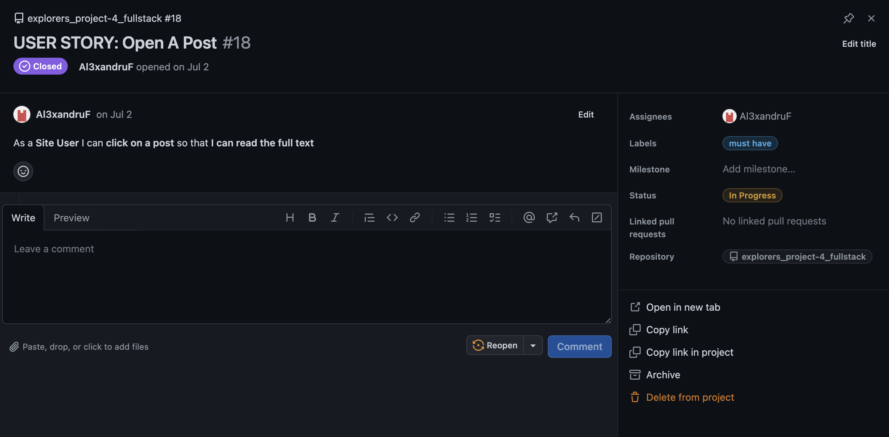
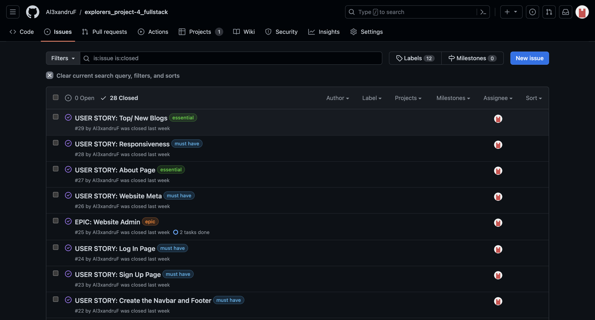
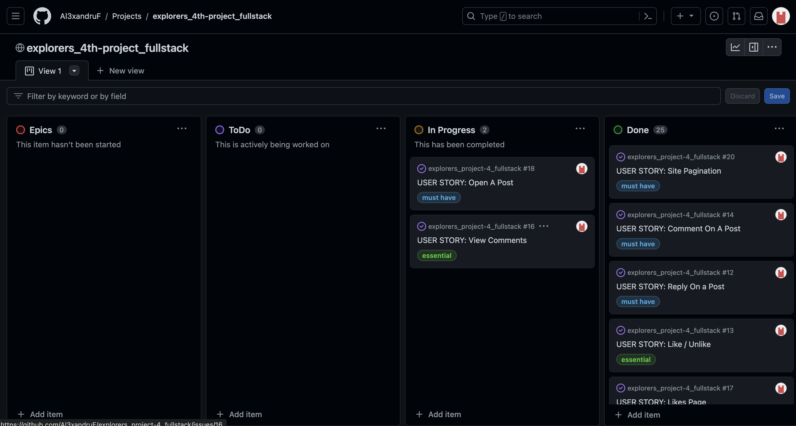

# e x p l o r e r s _

Start diving in a world of curiosity, facts, truthness...exploration. Explorers(link to be attached) is a place of knowledge, a place for the curious minds where the information is well researched before being presented to the users.

AM I RESPONSIVE GOES HERE

[View EXPLORERS live website here] (heroku project link to be attached)

## **Table of Contents**
### [User Experience](#user-experience-ux)
* [Project Goals](#project-goals)
* [Agile Methodology](#agile-methodology)
* [Target Audience](#target-audience)
* [First time user](#first-time-user)
* [Registered user](#registered-user)
* [Admin user](#admin-user)
### [Design](#design-1)
* [Color Scheme](#color-scheme)
* [Images](#images)
* [Favicon](#favicon)
* [Typography](#typography)
* [Wireframes](#wireframes)
* [Data Models](#data-models)
### [Security Features](#security-features-1)
### [Features](#features-1)
* [Existing Features](#existing-features)
* [Features Left to Implement](#features-left-to-implement)
* [Known Bugs](#known-bugs)
### [Technologies Used](#technologies-used-1)
* [Languages Used](#languages-used)
* [Databases Used](#databases-used)
* [Frameworks Used](#frameworks-used)
* [Programs Used](#programs-used)
### [Deployment and Local developement](#deployment-and-local-developement-1)
* [Local Developement](#local-developement)
* [ElephantSQL Database](#elephantsql-database)
* [Cloudinary](#cloudinary)
* [Heroku Deployment](#heroku-deployment)
### [Testing](#testing-1)
### [References](#references-1)
* [Docs](#docs)
* [Content](#content)
* [Acknowledgments](#acknowledgments)

## **User Experience (UX)**

The website offers a friendly and captivating experience to its users throughout the clean layout of the pages, high quality photos and of course the content itself. Depending on how much the users want to engage, they have two options:

1. If they want to become members, they have the possibility of registering and by doing so, they can take advantage of the full CRUD functionality the website has to offer. Besides this, they can subscribe, like the content they enjoy most and bookmark posts which they can later read, resulting in dedicated pages created. This way the users are keeping track of their activity on the website for better content management.
2. If visitors of the website choose not to become members, they can still browse through the content the same way as the registered users but with the option to subscribe only for newly added posts.

### **Project Goals**

- e x p l o r e r s _ - is a platform which has the mission to present to its users an educative, precise, well researched content about ancient civilizations and their contribution in the field of astronomy and modern society.

### **Agile Methodology**

Github Projects was used for applying the agile methodology:
- Issues were created and User Stories added.
- Project Board with Epics/ Todo/ In Progress/ and Done columns was created to keep track of progress.

User Stories templates

User Stories, Issues

Project Board

Have a detailed look [here](https://github.com/users/Al3xandruF/projects/7)

 ### **Target Audience**

 - Individuals interested on how our ancestors first approached astronomy and motion of celestial objects.
 - People looking for deeper answers in the fields of astronomy, formation and development of the universe.
 - Seekers of ancient myths and how our ancestors mixed science with mytholody.

### **First Time User**

- A clean page layout for easy navigation on then website.
- Appealing graphics and story blogs for keeping the users engaged.
- Easy Registration process, Log In and Subscribe.

### **Registered User**

- Easy and secure Login process for registered users.
- Being able to still subscribe if this was omitted before registration.
- CRUD functionality for comments/replies/edit/delete their comments on the owner's website posts.
- Personalised Likes/Bookmarks pages created after the user liked/bookmarked the content he/she was interested about.

### **Admin User**

- Separate and secured login page for the owner/admin of the web app.
- Access to an admin dashboard for full controll of the website's content.
- Ability to add, edit or delete posts on the web app.
- Being able to read, update and delete other user's posts for blog content management.
- Tagging posts and adding them on the dedicated tags page.
- Ability to delete user accounts for necessary control on managing user data and accounts.

## **Design**

The color used throughout the pages is a monochromatic brown which is inspired by the earth itself. The tool used was Adobe - Color Wheel.

 Color Theme

 

### **Images**

- All images were downloaded as a free license from [Adobe Stock](https://stock.adobe.com/uk/contributor/201212133/login).

### **Favicon**

- Adobe Stock and Favicon.io were used to generate the favicon icon.

 Favicon

 

### **Typography**

- Googleapis was used for generating the material family fonts throughout the pages.

### **Wireframes**

- No online platforms were used for this project. Instead hand-drawing on paper got done as this felt more engaging by the owner.

### **Data Models**

1. Django Default Authentification System User Model
    * This is the default authetification system powered by sessions within Django and used as a default/ user friendly system which can be customised by the admin based on their needs.
    * One-To-Many relationship with the Comment model: This means the Admin/User can have multiple comments,but each comment associated with only one User.
---
2. Profile Model
    * Data model created for setting up each user's profile.
    * Only the Admin can change/add/update the data in the backend/admin panel after user registration.
    * One-To-One relationship with the User/Owner.
---
3. Post Model:
    * Data model created for adding posts/ new posts by the Admin/Owner on the web app.
    * Custom fields got added so the post/posts show the most relevant info for existing users or visitors.
    * Only the admin can change the data in the backend.
    * Foreign key relation that establishes a many-to-one relationship with the Admin/Owner.
---
4. Comment Model:
    * Model created for each registered/logged in user to be able to add a comment/reply on one or multiple posts.
    * Further relevant info as User-Name and date of comment/reply being posted have been added.
    * The comment owner can apply CRUD functionality.
    * Foreign key relation that establishes a many-to-one relationship with the Post model.
---
5. Tag Model:
    * On adding a new post, the admin/owner has the chance of adding a tag which will be added to the tags page.
    * From the admin perspective, this is a tool that allows for marking or categorize the posts.
    * Many-To-Many relationship between the post and the tag.
---
6. Subscribe Model:
    * Data model added for visitors or registered users to be able to subscribe to the newsletter.
    * Many-To-One relationship between unsuscribed users and newsletter through the email field.
---
7. WebsiteMeta Model:
    * Data model created for future possible changes on presetational content of the website application.

## Security Features

### User Authentification

* This is the default authentication backend used by Django. It authenticates using credentials consisting of a user identifier and password. This was enabled and customised/ the web's application needs to accomodate user registration, authentification and account management through the Sign Up, Sign In and Admin dedicated pages.

* Unregistered/Not logged in users can view and subscribe to the web page.

* To add CRUD operations the user will have to register/authenticate through the dedicated pages. Also, if the user clicks on like or bookmark icons, the app will re-direct to the Log In page which has the option to register also.

### CSRF Tokens

* Django provides built-in protection against Cross-Site Request Forgery (CSRF) attacks. They are generated each time a user session occurs and invalidated everytime a user logs out, making them efficient against attacks.

### Sign Up/Log In Validation

* The register_user view validates form input NewUserForm class. It checks for validation errors, such as existing user-name, email, strong password and Log In criterias.

### Custom Error Pages

* 404 Error Page provides user with a redirect home button but also with several additional options.

### Features

More...

## Existing Features

* Home page which consists of:
    * Header with quick links for dedicated pages like Home, About, Posts, Likes, Bookmarks and authentication (Log In, Log Out and Sign Up functionality).
    * Top Blogs feature which shows the top 3 posts, sorted in descending order by popularity.
    * New Blogs feature which shows the most 3 recent posts added, sorted in descending order by date.
    * Footer with quick links to some of the most popular pages.
    * Social Media links.

* Post Page with various elements like tags, likes to posts, comments.
* Personalised content based on user behaviour.
* Users can subscribe, make an account and login on the page.
* Users can add comments, replies, likes to Posts and bookmark posts for future read.
* Users can update/ delete their comments.

* About Page:

* Posts Page:

* Likes Page:

* Bookmarks Page:

* Tags Page:

* Update Page:

* Delete Page:

* Footer:

* 404 Error:

## Features Left to Implement

* Search function to be implemented with advanced specific criteria.
* Javascript to be added for:
    * Gradient Effect in the background
    * Scroll position
    * Pop out messages for notifications, deletion of comments etc.
* CRUD functionality on Replies.
* Option to choose your avatar when registering.
* User profile to be added on existing accounts.
* For the purpose of this project criterias, these implementations were not necessary.

## Known Bugs

* Post Page Errors are showing on W3C Html Validator when comments/replies are added to posts:
    * Errors on adress validation test:
    
    

    * Errors on input validation test:

    

* After searching online for the cause of these errors and without any real solution found at the time, I decided to contact CI tutors which they instructed me to record this on the ReadMe and the steps being taken.
    * The cause for these errrors is how Django Syntax renders the html in my page source code.
    * Platforms which I looked for a solution or a lead on trying to understand what exactly in Django syntax causes these errors: Stackoverflow, GeeksforGeeks, medium, freecodecamp etc.
    * This is still looked into and will update the app after submission results.

* author.svg avatar throws a 404 in the console. In progress to be sorted...

## Technologies Used

### Languages Used

* [HTML](https://en.wikipedia.org/wiki/HTML)
* [CSS](https://en.wikipedia.org/wiki/CSS)
* [Javascript](https://en.wikipedia.org/wiki/JavaScript)
* [Python](https://en.wikipedia.org/wiki/Python_(programming_language))

### Database Used

* [ElephantSQL](https://www.elephantsql.com)
* [Cloudinary](https://cloudinary.com)

### Frameworks Used

* [Django](https://www.djangoproject.com)

### Programs Used

* [Github](https://github.com) - Storing my project(code) online.
* [Gitpod](https://www.gitpod.io/) - Wrinting the code online.
* [Heroku](https://www.heroku.com/) - Used as the cloud-based platform to deploy the site.
* [Google Fonts](https://fonts.google.com/) - Import main font the website.
* [Am I Responsive](https://ui.dev/amiresponsive) - Responsiveness on various devices. 
* [Git](https://git-scm.com) - For version control.
* [Favicon Generator](https://favicon.io) - Used to create the favicon.
* [JSHint](https://jshint.com/) - Javascript validation.
* [W3C Markup Validation Service](https://validator.w3.org) - HTML validation.
* [CSS Validation Service](https://jigsaw.w3.org/css-validator/) - CSS validation.
* [CI Python Linter](https://pep8ci.herokuapp.com) - Python Code validation.
* [Adobe Color Wheel](https://color.adobe.com/create/color-wheel) - Color Theme.

## Deployment and Local Development

Live deployment: [e x p l o r e r s _](https://explorers-4th-project-fs-17cd58235910.herokuapp.com)

### Local Development

#### How to Fork
1. Log in(or Sign Up) to Github
2. Go to repository for this project [e x p l o r e r s _](https://github.com/Al3xandruF/explorers_project-4_fullstack)
3. Click the fork button in the top right corner.

#### How to Clone
1. Log in(or Sign Up) to Github
2. Go to repository for this project [e x p l o r e r s _](https://github.com/Al3xandruF/explorers_project-4_fullstack)
3. Click on the code button, select whether you would like to clone with HTTPS, SSH or GitHub CLI and copy the link shown.
4. Open the terminal in your code editor and change the current working directory to the location you want to use for the cloned directory.
5. Type the following command in the terminal (after the git clone you will need to paste the link you copied in step 3 above)
6. Set up a virtual environment (this step is not required if you are using the Code Institute Template in GitPod as this will already be set up for you).
7. Install the packages from the requirements.txt file - run Command pip3 install -r requirements.txt.

### ElephantSQL Database
Database used for [e x p l o r e r s _](https://github.com/Al3xandruF/explorers_project-4_fullstack) is [ElephantSQL](https://www.elephantsql.com) PostgreSQL Database.

1. Click Create New Instance to start a new database.
2. Provide a name (this is commonly the name of the project).
3. Select the Tiny Turtle (Free) plan.
4. Tags can be left blank.
5. Select the Region and Data Center closest to you.
6. Once created, click on the new database name, where you can view the database URL and Password.

### Heroku Deployment
1. Log into [Heroku](https://www.heroku.com/) account or create an account.
2. Click the "New" button at the top right corner and select "Create New App".
3. Enter a unique application name
4. Select your region
5. Click "Create App"

#### Prepare enviroment and settings.py
1. In your GitPod workspace in the main directory, create an env.py file.
2. Add the DATABASE_URL value and your chosen SECRET_KEY value to the env.py file.
3. Update the settings.py file to import the env.py file and add the SECRET_KEY and DATABASE_URL file paths.
4. Comment out the default database configuration.
5. Save all files and make migrations.
6. Add the Cloudinary URL to env.py
7. Add the Cloudinary libraries to the list of installed apps.
8. Add the STATIC files settings - the url, storage path, directory path, root path, media url and default file storage path.
9. Link the file to the templates directory in Heroku.
10. Change the templates directory to TEMPLATES_DIR.
11. Add Heroku to the ALLOWED_HOSTS list the format ['app_name.heroku.com', 'localhost']

#### Add Heroku Config Vars:

* SECRET_KEY - Add any Django random secret key.
* CLOUDINARY_URL - Insert your own Cloudinary API key
* PORT - Set it to 8000.
* DISABLE_COLLECTSTATIC = 1 - this is temporary, and can be removed for the final deployment
* DATABASE_URL - Insert your own ElephantSQL database URL.

#### Heroku needs two additional files to deploy properly

* requirements.txt - where all technologies are registered.
* Procfile - add web: gunicorn explorers.wsgi

#### Deploy

1. Make sure DEBUG = False in the settings.py
2. Go to the deploy tab on Heroku and connect to GitHub, then search for your required repository.
3. Scroll to the bottom of the deploy page and either click Enable Automatic Deploys for automatic deploys or Deploy Branch to deploy manually. Manually deployed branches will need re-deploying each time the GitHub repository is updated.
4. Click 'Open App' to view the deployed live site.

